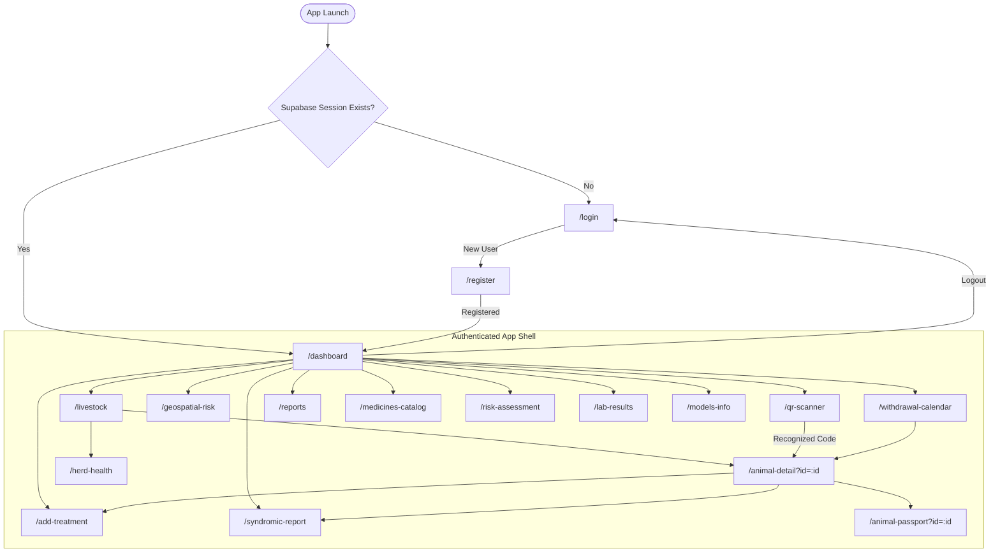
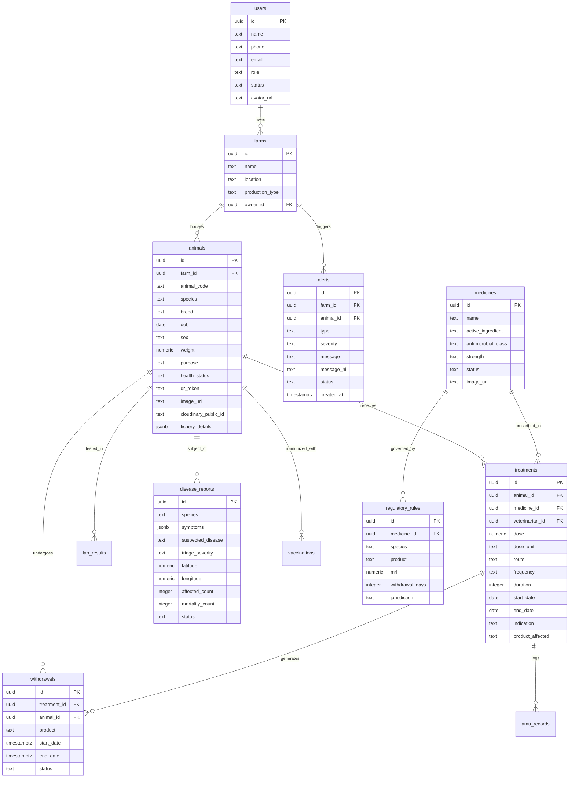

# FarmShield: Complete Flutter Architecture & Migration Analysis

> **Document Status**: Complete Comprehensive Audit  
> **Source Codebase**: `farmshield/` (Flutter / Dart)  
> **Target Platform**: `frontend/` (Next.js 14+ / TypeScript / Tailwind CSS / Supabase SSR)  
> **Rule**: Functional source of truth is the Flutter application. Next.js must achieve 100% parity with all business logic, validation, data operations, external services, and role workflows.

---

## Table of Contents

1. [Executive Summary & Architectural Overview](#1-executive-summary--architectural-overview)
2. [Complete Screen Inventory](#2-complete-screen-inventory)
3. [Complete Functionality Inventory (Screen by Screen)](#3-complete-functionality-inventory-screen-by-screen)
4. [Navigation Map & Routing Hierarchy](#4-navigation-map--routing-hierarchy)
5. [Reusable Component Inventory](#5-reusable-component-inventory)
6. [State Management & Data Layer Architecture](#6-state-management--data-layer-architecture)
7. [Supabase & Database Operations](#7-supabase--database-operations)
8. [Authentication & Session Flow](#8-authentication--session-flow)
9. [Media Storage & Cloudinary Pipeline](#9-media-storage--cloudinary-pipeline)
10. [Realtime Synchronization & WebSockets](#10-realtime-synchronization--websockets)
11. [External Services & ML Gateways](#11-external-services--ml-gateways)
12. [Design System, Typography, Colors & Assets](#12-design-system-typography-colors--assets)
13. [Flutter → Next.js Migration Architecture Recommendations](#13-flutter--nextjs-migration-architecture-recommendations)

---

## 1. Executive Summary & Architectural Overview

FarmShield is a veterinary public health and farm management application specifically engineered for Indian livestock and aquaculture producers (dairy cattle, buffalo, sheep/goat, poultry, swine, and inland fisheries). The core purpose is:

1. **Antimicrobial Use (AMU) Stewardship**: Tracking veterinary prescription, dosage, withdrawal periods, and Maximum Residue Limits (MRL) compliance under FSSAI and international standards.
2. **Withdrawal Period Management**: Live countdown clocks and calendar alerts to prevent contaminated milk, meat, or fish from entering the food chain before chemical clearance.
3. **Syndromic Disease Surveillance & Clinical Triage**: Rule-based epidemiological triage scoring (Mild, Moderate, Severe, Critical) with automatic reporting of notifiable diseases (e.g., FMD, Anthrax, PPR, Avian Influenza, Mastitis).
4. **Animal Passport & Traceability**: Individual animal QR codes containing cryptographic tokens, complete medical history, vaccination records, and withdrawal statuses.
5. **Geospatial Outbreak & Weather Risk Analysis**: Interactive spatial mapping of disease clusters integrated with Open-Meteo weather APIs to compute THI (Temperature-Humidity Index) and vector proliferation risks.
6. **Regulatory Compliance & Reports**: Exporting official audit logs, vet prescriptions, and farm compliance certificates via formatted PDF documents.

### Architecture Stack (Flutter)
- **State Management**: GetX (`GetxController`, `Rx<T>`, `Obx`, `GetView`, `Bindings`, `StateMixin`).
- **Data Layer**: Direct Supabase (`supabase_flutter`) with fallback to Express/FastAPI backend on Render (`https://farmshield-backend-api.onrender.com/api/`) and offline Hive storage (`OfflineStorageService`).
- **Authentication**: Supabase Auth (Email + Password, Phone OTP via Twilio/SMS, Google OAuth).
- **Storage**: Cloudinary unsigned/signed multipart REST uploads.
- **Mapping & Charts**: `google_maps_flutter`, `fl_chart`.
- **Localization**: Built-in 4-language support (`AppTranslations`: English `en`, Hindi `hi`, Marathi `mr`, Punjabi `pa`).

---

## 2. Complete Screen Inventory

| # | Flutter Screen / View | Route (`AppRoutes`) | Purpose / Description | Auth Required | Role Restrictions | Primary Data Source | Main Actions |
|---|---|---|---|---|---|---|---|
| 1 | `LoginView` | `/login` | User authentication via email/password, phone OTP, or Google OAuth | No | Public (All) | Supabase Auth, `public.users` | Sign in, send OTP, verify OTP, Google sign-in, navigate to register |
| 2 | `RegisterView` | `/register` | New user onboarding, farm creation, role selection | No | Public (All) | Supabase Auth, `public.users`, `public.farms` | Input user info, select role (`farmer`, `veterinarian`), create initial farm, submit registration |
| 3 | `DashboardView` | `/dashboard` | Command center with KPIs, active withdrawal alerts, disease alerts, quick actions, weather risk | Yes | All authenticated (`farmer`, `vet`, `admin`) | `animals`, `withdrawals`, `alerts`, `treatments`, Open-Meteo API | View live stats, jump to add treatment, scan QR, view weather risk, filter alerts, AMU sheet |
| 4 | `LivestockView` | `/livestock` | Herd & flock directory grouped by species/category with search and filter | Yes | All | `public.animals`, `public.farms` | Search tag ID, filter by category (`cattle`, `poultry`, etc.), add animal dialog, tap to detail |
| 5 | `HerdHealthView` | `/herd-health` | Herd-level health overview, vaccination status, and chronic disease metrics | Yes | All | `animals`, `treatments`, `vaccinations` | View herd risk metrics, pending vaccinations, quarantine list, filter by status |
| 6 | `AnimalDetailView` | `/animal-detail` | Single animal 360° record: health timeline, treatments, active withdrawals, vitals | Yes | All | `animals`, `treatments`, `withdrawals`, `vaccinations` | View passport, edit animal, report disease, log treatment, download animal passport |
| 7 | `AnimalPassportView` | `/animal-passport` | Public/Auditor traceability card displaying animal QR code, MRL clearance, audit token | Yes | All | `animals`, `withdrawals`, `farms` | Verify QR token, share digital passport, print physical PDF card, copy shareable link |
| 8 | `QRScannerPage` / `QRScannerView` | `/qr-scanner` | Camera scanner to scan physical ear-tag QR codes and animal passports | Yes | All | Camera / `mobile_scanner` | Scan QR string, parse JSON or animal code, navigate directly to `/animal-detail` |
| 9 | `AddTreatmentView` | `/add-treatment` | Clinical prescription & administration form with automatic withdrawal period calculation | Yes | `veterinarian`, `farmer` | `animals`, `medicines`, `regulatory_rules`, `treatments`, `withdrawals` | Select animal, pick medicine, enter dosage, calculate withdrawal dates, submit prescription |
| 10 | `WithdrawalCalendarView` | `/withdrawal-calendar` | Interactive calendar displaying date-wise milk, meat, and egg withdrawal embargoes | Yes | All | `public.withdrawals`, `public.animals` | Monthly/weekly calendar navigation, tap date to view blocked animals, export calendar |
| 11 | `RiskAssessmentView` | `/risk-assessment` | Farm-level antimicrobial resistance (AMR) and biosafety compliance audit score | Yes | All | Render ML API / `ml_predictions`, fallback rule engine | Run assessment, adjust hygiene/biosecurity sliders, calculate risk score (0-100), view guidance |
| 12 | `GeospatialRiskMapView` | `/geospatial-risk` | Spatial outbreak map plotting disease clusters, radius halos, and farm geofences | Yes | All | `public.disease_reports`, Open-Meteo API, Google Maps | Toggle layers (outbreaks, THI heatmaps, quarantine zones), tap pin for outbreak details |
| 13 | `MedicinesCatalogView` | `/medicines-catalog` | Reference catalog of approved veterinary pharmaceuticals, MRLs, and withdrawal norms | Yes | All | `public.medicines`, `public.regulatory_rules` | Search drugs, filter by antimicrobial class (WHO CIA), view standard withdrawal days & MRLs |
| 14 | `SyndromicReportView` | `/syndromic-report` | Emergency syndromic reporting tool with automated clinical triage algorithm | Yes | All | `public.disease_reports`, `clinical_triage_service` | Check symptoms, compute triage severity, capture GPS location, upload photo, notify vets |
| 15 | `LabResultsView` | `/lab-results` | Laboratory diagnostic reports, culture sensitivity, milk MRL testing, water quality | Yes | All | `public.lab_results`, `public.animals` | View lab tests, filter by analyte (e.g. Somatic Cell Count, Tetracycline residue), add new test |
| 16 | `ReportsView` | `/reports` | Exportable regulatory compliance documents, AMU logs, and audit-ready PDF generation | Yes | All (`admin`, `vet` focus) | All tables + `PdfGeneratorService` | Select date range, choose report type (AMU summary, MRL compliance, farm ledger), generate/print PDF |
| 17 | `ModelsInfoView` | `/models-info` | Technical transparency page detailing the ML models, training datasets, and accuracy | Yes | All | Static configs + Render `/api/ml/models-info` | Inspect model metrics (Overuse Risk Model, Compliance Risk Model, THI Index formula) |

---

## 3. Complete Functionality Inventory (Screen by Screen)

### 3.1. Authentication Module (`/login` & `/register`)

#### `LoginView`
- **Displayed Data**: App brand identity (FarmShield logo, tagline "Smart Livestock & AMU Management"), tab switcher (Email vs. Phone OTP), Google Sign-in button.
- **Form Controls & Inputs**:
  - Email Mode: Email address field, Password field (with toggleable show/hide eye icon).
  - Phone Mode: Country code prefix (`+91` default), 10-digit mobile number input, 6-digit OTP verification field (revealed after OTP is triggered).
- **Validation Rules**:
  - Email: Valid regex pattern `^[\w-\.]+@([\w-]+\.)+[\w-]{2,4}$`.
  - Password: Minimum 6 characters.
  - Phone: Exactly 10 digits; must not contain letters or special characters.
  - OTP: Exactly 6 numerical digits.
- **Interactions & Button Handlers**:
  - `Login with Email`: Triggers `authController.signInWithEmail(email, password)`.
  - `Send OTP`: Triggers `authController.sendPhoneOtp(phone)`. Starts a 60-second countdown timer for resend.
  - `Verify OTP & Login`: Triggers `authController.verifyPhoneOtp(phone, otp)`.
  - `Google Sign-in`: Triggers `authController.signInWithGoogle()`. Uses Supabase OAuth with redirect callback.
  - `Sign Up Link`: Navigates to `/register`.
- **States**:
  - Loading: Button shows circular progress indicator, input fields are disabled.
  - Error: SnackBar / banner alert displaying Supabase error message (e.g., "Invalid credentials", "User not found").

#### `RegisterView`
- **Displayed Data**: Registration stepper or single scrollable form with role badges.
- **Form Controls & Inputs**:
  - Full Name (`name`).
  - Email Address (`email`).
  - Phone Number (`phone`).
  - Password and Confirm Password.
  - Role Selection Segmented Control: `Farmer` vs. `Veterinarian` (with icon and description).
  - Farm Profile Section (if Farmer selected):
    - Farm Name (`farm_name`).
    - Location / District (`location`).
    - Production Type Dropdown: `Dairy`, `Broiler`, `Layer`, `Goat/Sheep`, `Swine`, `Aquaculture`, `Mixed`.
  - Vet Credentials Section (if Veterinarian selected):
    - Veterinary Council Registration Number (`vet_reg_number`).
    - Clinic / Department Name.
- **Validation Rules**:
  - Name: Required, min 2 characters.
  - Passwords: Min 6 characters, must match confirm password.
  - Farm Name: Required if role is `farmer`.
  - Vet Reg Number: Required if role is `veterinarian`.
- **Backend Mutations**:
  - Creates auth user in `auth.users`.
  - Profile automatically upserted or inserted into `public.users` (`id`, `name`, `phone`, `email`, `role`, `status`).
  - If farmer, inserts record into `public.farms` (`name`, `location`, `production_type`, `owner_id`).

---

### 3.2. Dashboard Module (`/dashboard`)

#### `DashboardView`
- **Header**:
  - User greeting with profile avatar or initials badge.
  - Farm switcher dropdown (if user manages multiple farms).
  - Active Language toggle (`EN`, `HI`, `MR`, `PA`).
  - Notification Bell Icon with unread badge counter (subscribes to `alerts`).
- **Key Performance Indicator (KPI) Cards** (`DashboardKpiCard`):
  1. *Total Livestock*: Count of active animals across categories.
  2. *Under Withdrawal*: Count of animals currently subject to milk/meat embargo. Rendered in Warning Amber/Red with pulse badge.
  3. *Active Treatments*: Ongoing pharmaceutical regimens.
  4. *Pending Alerts / Quarantines*: Disease reports or withdrawal breaches requiring attention.
- **Active Withdrawal Countdown Section** (`WithdrawalCountdownCard`):
  - Horizontal list or card stack of animals with active withdrawal periods.
  - Displays: Animal Code, Product (`Milk`, `Meat`, `Eggs`, `Fish`), Medicine Name, Progress Bar (% time elapsed), and live countdown (e.g., "2 days 4 hours remaining").
  - Warning tag if countdown `< 24 hours`.
- **Weather & THI Risk Card** (`WeatherRiskCard`):
  - Live data from Open-Meteo API using device coordinates.
  - Displays: Ambient Temperature (°C), Relative Humidity (%), Heat Index / THI score.
  - Risk Level: *Normal* (< 72), *Mild Stress* (72–78), *Moderate Stress* (79–88), *Severe Heat Stress* (> 88).
  - Disease Vector Risk: Mosquito/tick proliferation multiplier based on precipitation and temperature.
- **Disease Outbreak Trend Chart** (`DiseaseTrendChart`):
  - `fl_chart` Line or Bar chart showing syndromic cases over the past 30 days.
- **Quick Action Grid** (`QuickActionsGrid`):
  - *Add Treatment*: Direct navigation to `/add-treatment`.
  - *Scan Ear Tag*: Direct launch of `/qr-scanner`.
  - *Report Sickness*: Direct navigation to `/syndromic-report`.
  - *Withdrawal Calendar*: Direct navigation to `/withdrawal-calendar`.
  - *AMU Analytics*: Opens `AmuAnalyticsSheet` bottom modal.
- **Realtime Banner Notification**:
  - In-app banner triggered when a new high-severity alert is inserted into `public.alerts`.

---

### 3.3. Livestock Directory & Herd Health (`/livestock` & `/herd-health`)

#### `LivestockView`
- **Search & Filter Controls**:
  - Text search bar (matches `animal_code`, `breed`, `purpose`).
  - Category Pills (`CategoryTile`): `All`, `Cattle`, `Buffalo`, `Sheep/Goat`, `Poultry`, `Swine`, `Aquaculture`.
  - Health Status Filter: `All`, `Healthy`, `Under Treatment`, `In Withdrawal`, `Quarantined`.
- **Livestock Cards List**:
  - Animal image (Cloudinary or breed-specific fallback illustration).
  - Animal Code / Tag Number (prominent bold).
  - Species and Breed (e.g., "Gir Cattle", "Murrah Buffalo").
  - Health Status Badge (`AppBadge`):
    - `Healthy` (Green)
    - `Under Treatment` (Blue)
    - `Withdrawal Active` (Amber / Warning Red)
    - `Quarantine` (Red)
  - Age / DOB and Weight (kg).
- **Floating Action Button / Header Button**:
  - `+ Add Animal`: Opens modal dialog / bottom sheet to register a new animal:
    - Species dropdown.
    - Breed input with autocomplete suggestions.
    - Tag ID / Animal Code (with auto-generate button or manual entry).
    - DOB / Age in months.
    - Sex (`Female`, `Male`).
    - Weight (kg).
    - Purpose (`Dairy`, `Meat`, `Breeding`, `Egg`, `Aquaculture Commercial`).
    - Fishery Specifics (if species is `Aquaculture`): Pond ID, Stocking Density, Water Volume ($m^3$).
    - Photo upload button (triggers camera/gallery and Cloudinary upload).

#### `HerdHealthView`
- **Aggregated Health Metrics**:
  - Herd Mortality Rate (%).
  - Morbidity Rate (%).
  - Vaccination Coverage Rate (% of animals up to date).
- **Vaccination Schedule Table**:
  - Upcoming booster shots (FMD, Black Quarter, Brucellosis, Anthrax).
  - Animal tag IDs due, recommended administration window, assigned veterinarian.
- **Quarantine Management Panel**:
  - List of isolated animals with infectious disease tags.
  - Daily temperature and symptom logs.

---

### 3.4. Animal Detail & Digital Passport (`/animal-detail` & `/animal-passport`)

#### `AnimalDetailView`
- **Header Profile**:
  - High-res animal photo (Cloudinary preview with full-screen zoom).
  - Animal Code, Species, Breed, and Farm ID.
  - Active Health Status Badge.
  - Quick action icons: Share, Edit (`EditAnimalBottomSheet`), Delete (Admin only).
- **Tab Bar Navigation**:
  1. *Overview*: Basic stats (DOB, Age, Weight, Purpose, Sire/Dam info, Fishery parameters).
  2. *Medical History*: Chronological timeline of all treatments, medicines administered, dosages, and treating vet.
  3. *Active Withdrawals*: Specific product withdrawal statuses (e.g., "Milk safe after: Oct 24, 2024", "Meat safe after: Nov 12, 2024").
  4. *Vaccinations*: Past and scheduled immunizations.
  5. *Lab Tests*: Linked laboratory diagnostics and somatic cell counts.
- **Bottom Action Bar**:
  - `Log Treatment`: Navigates to `/add-treatment` with `animal_id` preselected.
  - `Report Issue`: Opens `ReportHealthIssueSheet`.
  - `View Passport`: Navigates to `/animal-passport`.

#### `AnimalPassportView`
- **Visual Design**: High-credibility certificate / digital passport card layout.
- **Traceability Data**:
  - High-resolution QR Code generated from `qr_token` or structured JSON (`{ id, code, farm, hash }`).
  - Cryptographic Verification Status: "Official Government Verified Record" checkmark.
  - Animal Demographics: Tag ID, Breed, Species, Sex, Farm of Origin, GPS coordinates of farm.
  - Antimicrobial Clearance Badge:
    - "CLEARED FOR HUMAN CONSUMPTION" (Green seal) IF all withdrawal dates have passed.
    - "WITHDRAWAL EMBARGO ACTIVE - DO NOT CONSUME / DO NOT MILK" (Red alert banner) IF any withdrawal is active.
- **Export Actions**:
  - `Share Digital Link`: Native share sheet with public verification URL.
  - `Download Official PDF Passport`: Uses `PdfGeneratorService` to render print-ready passport with QR code, farm stamp, and medical summary.

---

### 3.5. QR Scanner Module (`/qr-scanner`)

#### `QRScannerPage` / `QRScannerView`
- **Interface**:
  - Camera viewfinder overlay with high-contrast scanning reticle and corner brackets.
  - Flashlight / Torch toggle button.
  - Switch camera button (Back vs. Front).
  - Manual Tag Entry fallback text button.
- **Scanning Logic**:
  - Detects 2D QR codes and Code 128 barcodes.
  - Supported QR formats:
    1. Raw Animal Code string (e.g., `FS-IND-2024-00129`).
    2. JSON Payload (`{ "animal_code": "...", "farm_id": "...", "token": "..." }`).
    3. Deep URL (`https://farmshield.app/animal/<id>`).
- **Flow**:
  - Upon successful scan, triggers haptic feedback.
  - Queries `public.animals` by `animal_code` or `id`.
  - If found: Replaces current route with `/animal-detail?id=<id>`.
  - If not found: Displays alert dialog "Animal not registered in your farm database" with option to register a new animal with this tag.

---

### 3.6. Treatment & AMU Prescription Module (`/add-treatment`)

#### `AddTreatmentView`
- **Context**: The most critical clinical workflow in FarmShield. Directly governs chemical withdrawal safety.
- **Form Fields & Step-by-Step Logic**:
  1. *Animal Selection*:
     - Dropdown / search modal to pick animal.
     - Displays selected animal's current species, weight, and existing active treatments.
  2. *Medicine Selection*:
     - Searchable catalog dropdown from `public.medicines`.
     - Displays active ingredient (e.g., *Ceftiofur Sodium*, *Oxytetracycline*, *Enrofloxacin*), antimicrobial class, and WHO classification.
  3. *Dosage & Administration*:
     - Dose numeric input (e.g., `5.0`).
     - Dose Unit dropdown: `mg/kg`, `ml`, `mg`, `IU`, `bolus`, `g`.
     - Route of Administration dropdown: `Intramuscular (IM)`, `Subcutaneous (SC)`, `Intravenous (IV)`, `Intramammary`, `Oral`, `Water/Feed Premix`, `Bath (Aquaculture)`.
     - Frequency dropdown: `Once Daily (OD)`, `Twice Daily (BID)`, `Every 48 Hours`, `Single Dose`.
     - Treatment Duration (days): Numeric counter (`1` to `30`).
  4. *Clinical Indication*:
     - Reason for treatment (e.g., *Acute Mastitis*, *Bovine Respiratory Disease*, *Foot Rot*, *Bacterial Gill Disease*).
  5. *Treating Veterinarian*:
     - Autopopulated with logged-in user if role is `veterinarian`, or selectable vet directory.
  6. *Automated Withdrawal Calculator*:
     - System automatically queries `public.regulatory_rules` matching:
       - `medicine_id` = selected medicine.
       - `species` = selected animal species.
     - Calculates:
       - `start_date`: Treatment start (default: Today/Now).
       - `treatment_end_date`: `start_date + duration days`.
       - `withdrawal_days`: Looked up from rule (e.g., 4 days for milk, 28 days for meat).
       - `clearance_date`: `treatment_end_date + withdrawal_days`.
     - User sees interactive visual preview card:
       - 🥛 **Milk Withdrawal**: "Safe to resume milking on [Date, Time]"
       - 🥩 **Meat Withdrawal**: "Safe for slaughter on [Date, Time]"
       - 🥚 **Egg / Fish Withdrawal**: Product-specific clearance timeline.
  7. *Off-Label / Cascade Warning*:
     - If dosage or route differs from standard regulatory rule, displays an alert: "Off-label usage detected. Extended withdrawal period applied according to statutory cascade regulations."
- **Mutations Created on Submit**:
  - Inserts into `public.treatments`.
  - Automatically inserts into `public.withdrawals` for each affected product (`product`, `start_date`, `end_date`, `status: 'active'`).
  - Inserts into `public.amu_records` (for national antimicrobial surveillance tracking).
  - Updates `public.animals` -> `health_status = 'in_treatment'`.
  - Creates automated reminder alert in `public.alerts`.

---

### 3.7. Withdrawal Calendar Module (`/withdrawal-calendar`)

#### `WithdrawalCalendarView`
- **Visual Interface**:
  - Monthly calendar view (`table_calendar`) with day cells marked with color-coded dot badges:
    - 🔴 Red: Meat withdrawal active.
    - 🟡 Amber: Milk withdrawal active.
    - 🔵 Blue: Scheduled treatment administration.
    - 🟢 Green: Full clearance date for one or more animals.
  - View Toggle: Month View, Week View, Day Agenda View.
- **Date Agenda Panel (Below Calendar)**:
  - Tapping a date filters the agenda list for that specific day.
  - Lists every animal undergoing embargo on that date:
    - Animal Tag ID.
    - Medicine involved.
    - Blocked product(s).
    - Days remaining until clearance.
- **Export & Notification**:
  - Button to export the month's embargo schedule to PDF or iCal format.

---

### 3.8. Geospatial Outbreak & Weather Risk (`/geospatial-risk`)

#### `GeospatialRiskMapView`
- **Map View**:
  - Full-screen `google_maps_flutter` interactive map centered on the user's farm location.
  - Multi-layer toggle:
    1. *Outbreak Clusters*: Markers showing recent syndromic reports and lab-confirmed contagious outbreaks (FMD, Lumpy Skin Disease, African Swine Fever, White Spot Syndrome).
    2. *Quarantine Buffers*: Semi-transparent circle overlays representing 5km surveillance zones and 10km containment perimeters.
    3. *Weather THI Heatmap*: Color gradient representing heat stress across districts.
- **Interactive Marker Detail Card** (`RiskPointDetailCard`):
  - Tapping an outbreak pin slides up a bottom sheet with:
    - Disease Name & Case Count.
    - Distance from user's farm (km).
    - Date reported.
    - Confirmed / Suspected status.
    - Biosecurity recommendations (e.g., "Halt animal transport within 10km radius; initiate ring vaccination").
- **Farm Geofence Overview** (`RiskSummaryCard`):
  - Farm boundary polygon.
  - Calculated Local Outbreak Risk Score: Low, Moderate, Severe.

---

### 3.9. Medicines & Regulatory Catalog (`/medicines-catalog`)

#### `MedicinesCatalogView`
- **Data Display**:
  - Comprehensive index of veterinary drugs from `public.medicines` linked to `public.regulatory_rules`.
- **Search & Filters**:
  - Search by brand name, generic name, or active ingredient.
  - Filter by Antimicrobial Class: *Beta-lactams, Tetracyclines, Aminoglycosides, Macrolides, Quinolones, Sulfonamides*.
  - Filter by WHO CIA (Critically Important Antimicrobial) Tier: *Highest Priority Critically Important (HPCIA)*, *Critically Important*, *Highly Important*.
  - Species filter (Cattle, Buffalo, Sheep, Swine, Poultry, Fish).
- **Drug Detail Modal**:
  - Standard dosage range per species.
  - Approved routes of administration.
  - Regulatory MRLs ($\mu g/kg$ or $ppb$) per target tissue (Muscle, Liver, Kidney, Milk, Eggs).
  - Standard withdrawal period in days for meat, milk, and eggs.
  - Statutory restrictions (e.g., banned substances like Chloramphenicol, Nitrofurans).

---

### 3.10. Syndromic Reporting & Clinical Triage (`/syndromic-report`)

#### `SyndromicReportView`
- **Purpose**: Rapid field reporting of disease symptoms with automated AI/rule-based triage to catch epidemic outbreaks early.
- **Form Workflow**:
  1. *Affected Species*: Select cattle, buffalo, goat, poultry, swine, fish.
  2. *Number of Animals*:
     - Total herd size.
     - Number showing symptoms (Morbidity count).
     - Number deceased (Mortality count).
  3. *Symptom Checklist* (Multi-select segmented by organ system):
     - *General*: High fever, sudden anorexia, severe lethargy, sudden death.
     - *Respiratory*: Nasal discharge, coughing, respiratory distress, grunting.
     - *Digestive*: Profuse diarrhea, bloody stool, bloat, colic.
     - *Cutaneous/Mucosal*: Blisters/vesicles on tongue/lips, skin nodules (LSD), hoof lesions, lameness.
     - *Reproductive*: Abortions, retained placenta.
     - *Aquaculture specific*: Abnormal swimming, gill discoloration, red spots, surface gasping.
  4. *Automated Triage Algorithm* (`ClinicalTriageService`):
     - As symptoms are checked, the controller runs real-time rule inference:
       - **Critical / Red**: Vesicles on mouth/feet (suspected FMD), sudden high mortality, bloody discharge from natural orifices (Anthrax).
       - **Severe / Orange**: High fever with respiratory distress, abortion storms.
       - **Moderate / Yellow**: Persistent diarrhea, single animal lameness.
       - **Mild / Green**: Mild nasal discharge, transient anorexia.
     - Triage severity badge updates dynamically with immediate protocol guidance.
  5. *Media & Location Capture*:
     - Photo upload (lesions, affected animals) -> direct Cloudinary upload.
     - Automatic GPS tag capture (device coordinates).
  6. *Submission*:
     - Inserts record into `public.disease_reports`.
     - If severity is `Severe` or `Critical`, triggers automatic high-priority broadcast to local government veterinarians via `fcm_alert_service` and `alerts` table.

---

### 3.11. Lab Results & Diagnostic Testing (`/lab-results`)

#### `LabResultsView`
- **Data Table / Card List**:
  - Diagnostic test records from `public.lab_results`.
  - Displays: Sample ID, Animal Tag ID, Test Type (*Milk Residue Screening, Somatic Cell Count, Blood Biochemistry, Culture & Antimicrobial Sensitivity, Water Quality*), Date Tested, Laboratory Name.
- **Residue Clearance Status**:
  - Test result vs. FSSAI Maximum Residue Limit (MRL).
  - Pass / Compliant (Green) vs. Fail / Exceeded MRL (Red).
- **Add Lab Result Form**:
  - Modal to log new lab certificate: animal selection, analyte, concentration detected, unit ($\mu g/kg$, $CFU/ml$), pass/fail flag, and lab report PDF/image attachment.

---

### 3.12. Regulatory Reports & PDF Generation (`/reports`)

#### `ReportsView`
- **Report Types Available**:
  1. *Farm AMU Compliance Ledger*: Comprehensive audit trail of all antibiotics administered over a chosen date range, dosage, and vet prescriptions.
  2. *Withdrawal Period Compliance Certificate*: Legal declaration certifying that all milk and meat produced during the period adhered to statutory clearance days.
  3. *Herd Health & Vaccination Certificate*: Animal-wise immunization status for livestock transit or sale.
  4. *Disease Outbreak & Mortality Log*: Required for insurance claims and veterinary authority audits.
- **Filter Controls**:
  - Date range picker (From Date - To Date).
  - Species / Herd filter.
  - Include/Exclude active treatments.
- **Actions**:
  - `Preview Report`: Generates formatted document preview.
  - `Export PDF`: Invokes `PdfGeneratorService` to generate structured, watermarked PDF with FarmShield letterhead, farm details, QR verification code, and signature blocks.
  - `Print / Direct Share`: Triggers native print dialog or email attachment.

---

### 3.13. AI / ML Risk Assessment & Models Info (`/risk-assessment` & `/models-info`)

#### `RiskAssessmentView`
- **AMU Overuse & Biosecurity Audit**:
  - Interactive questionnaire evaluating farm biosecurity, sanitation frequency, stocking density, feed quality, and vaccination history.
  - Dynamic score gauge (0 to 100):
    - *0–40 (High AMR Risk / Critical)*: Excessive antibiotic reliance; poor biosecurity.
    - *41–70 (Moderate Risk)*: Satisfactory; improvements recommended in quarantine protocols.
    - *71–100 (Optimal Stewardship)*: Excellent biosecurity; minimal prophylactic AMU.
  - Connects to backend endpoint `/api/ml/overuse-risk` with local deterministic fallback calculation.

#### `ModelsInfoView`
- **Transparency & Scientific Documentation**:
  - Outlines the machine learning and deterministic models used:
    1. *AMU Overuse Risk Predictor*: Random Forest / XGBoost model trained on herd demographics and treatment frequencies.
    2. *THI & Weather Vulnerability Index*: Standard bioclimatic formulas evaluating heat stress on milk yield and immune depression.
    3. *Clinical Triage Expert System*: Decision-tree matrix aligned with WOAH (World Organisation for Animal Health) disease definitions.

---

## 4. Navigation Map & Routing Hierarchy

### 4.1. Navigation Flow Diagram



### 4.2. Routing Table & Route Guards (`AppPages` & `AppRoutes`)

```dart
// Mapped from farmshield/lib/app/routes/app_routes.dart and app_pages.dart
abstract class Routes {
  static const LOGIN = '/login';
  static const REGISTER = '/register';
  static const DASHBOARD = '/dashboard';
  static const LIVESTOCK = '/livestock';
  static const HERD_HEALTH = '/herd-health';
  static const ANIMAL_DETAIL = '/animal-detail';
  static const ANIMAL_PASSPORT = '/animal-passport';
  static const QR_SCANNER = '/qr-scanner';
  static const ADD_TREATMENT = '/add-treatment';
  static const WITHDRAWAL_CALENDAR = '/withdrawal-calendar';
  static const RISK_ASSESSMENT = '/risk-assessment';
  static const GEOSPATIAL_RISK = '/geospatial-risk';
  static const MEDICINES_CATALOG = '/medicines-catalog';
  static const SYNDROMIC_REPORT = '/syndromic-report';
  static const LAB_RESULTS = '/lab-results';
  static const REPORTS = '/reports';
  static const MODELS_INFO = '/models-info';
}
```

- **Conditional Redirect Logic**:
  - Root route evaluates `Supabase.instance.client.auth.currentSession`.
  - If null -> redirects to `/login`.
  - If authenticated -> initializes `DashboardBinding` and renders `/dashboard`.
  - Role-based route restriction: `veterinarian` and `admin` roles have access to approve regulatory prescriptions, edit regulatory rules, and access full regional outbreak data. `farmer` is restricted to farm-level records.

---

## 5. Reusable Component Inventory

The Flutter application defines a cohesive design system in `farmshield/lib/core/widgets/` and module-specific custom widgets:

### 5.1. Core Reusable UI Widgets

| Component | Flutter File | Purpose & Props | Next.js Equivalent Component |
|---|---|---|---|
| `AppButton` | `core/widgets/app_button.dart` | Primary, secondary, outline, danger button styles with built-in loading spinner (`isLoading`), prefix icon, disabled state | `components/ui/button.tsx` (cva variants: primary, secondary, outline, destructive) |
| `AppTextField` | `core/widgets/app_text_field.dart` | Form text input with label, prefix/suffix icons, helper text, error message, password toggle, keyboard types | `components/ui/input.tsx` + `components/ui/form.tsx` (React Hook Form) |
| `AppCard` | `core/widgets/app_card.dart` | Standard container with rounded corners (16px), subtle border, box shadow, customizable padding, tap handler | `components/ui/card.tsx` |
| `AppBadge` | `core/widgets/app_badge.dart` | Status chip with variant colors: `success` (green), `warning` (amber), `danger` (red), `info` (blue), `neutral` (gray). Supports small dot indicator | `components/ui/badge.tsx` |
| `AppHeaderBar` | `core/widgets/app_header_bar.dart` | Consistent top app bar with title, back button, actions menu, and language switch | `components/layout/header.tsx` / `components/layout/top-nav.tsx` |
| `AppLoadingSkeleton` | `core/widgets/app_loading_skeleton.dart` | Shimmer loading placeholders for cards, list items, and metric blocks | `components/ui/skeleton.tsx` |
| `AppEmptyState` | `core/widgets/app_empty_state.dart` | Centered empty state illustration, title, description, and call-to-action button | `components/ui/empty-state.tsx` |

### 5.2. Module Custom Domain Widgets

| Component | Flutter File | Purpose & Functionality |
|---|---|---|
| `DashboardKpiCard` | `modules/dashboard/widgets/dashboard_kpi_card.dart` | Top dashboard metric card with icon, numeric value, subtitle trend, and click action |
| `WithdrawalCountdownCard` | `modules/dashboard/widgets/withdrawal_countdown_card.dart` | Card showing animal tag, product badge (Milk/Meat), live timer countdown, and progress bar |
| `WeatherRiskCard` | `modules/dashboard/widgets/weather_risk_card.dart` | Live weather card displaying temperature, humidity, THI stress status, and vector risk badge |
| `DiseaseTrendChart` | `modules/dashboard/widgets/disease_trend_chart.dart` | `fl_chart` line/bar chart displaying syndromic case frequency over 7, 14, or 30 days |
| `QuickActionsGrid` | `modules/dashboard/widgets/quick_actions_grid.dart` | Grid of 4–6 quick launch action cards with colored circular icons |
| `AmuAnalyticsSheet` | `modules/dashboard/widgets/amu_analytics_sheet.dart` | Bottom sheet summarizing monthly antimicrobial consumption by class (Beta-lactam, etc.) |
| `CategoryTile` | `modules/livestock/widgets/category_tile.dart` | Horizontal scrolling category filter chip with species icon and count badge |
| `HerdHealthCard` | `modules/livestock/widgets/herd_health_card.dart` | Summary card for herd vaccination rates, quarantine counts, and mortality metrics |
| `EditAnimalBottomSheet` | `modules/animal_detail/widgets/edit_animal_bottom_sheet.dart` | Slide-up modal to edit animal weight, status, purpose, or photo |
| `ReportHealthIssueSheet` | `modules/animal_detail/widgets/report_health_issue_sheet.dart` | Fast symptom reporting sheet bound to the active animal |
| `RiskPointDetailCard` | `modules/geospatial_risk/widgets/risk_point_detail_card.dart` | Outbreak detail card appearing when a map marker is selected |
| `RiskSummaryCard` | `modules/geospatial_risk/widgets/risk_summary_card.dart` | Overall district biosecurity status card anchored over the map |

---

## 6. State Management & Data Layer Architecture

### 6.1. GetX Architecture in Flutter
Every module follows the strict GetX triple pattern:
1. `*Binding`: Registers the controller lazily via `Get.lazyPut<Controller>(() => Controller())`.
2. `*Controller`: Subclasses `GetxController` or `StateMixin<T>`. Manages reactive variables (`RxList`, `RxBool`, `RxString`, `Rx<Model>`).
3. `*View`: Subclasses `GetView<Controller>`. Renders reactive UI using `Obx(() => ...)` or controller methods.

### 6.2. Dual-Layer & Offline Data Strategy
The Flutter app employs a 3-tier resilient data pipeline:
1. **Tier 1 (Direct Supabase)**: Primary realtime connection using `SupabaseClient`.
2. **Tier 2 (Render Backend Gateway)**: Used for specialized machine learning scoring endpoints:
   - `GET /api/ml/models-info`
   - `POST /api/ml/overuse-risk`
   - `POST /api/ml/compliance-risk`
3. **Tier 3 (Local Hive Cache & Queue Sync)**:
   - `OfflineStorageService` caches user profile, animals list, and active withdrawals locally in Hive boxes.
   - When offline, writes (such as treatment logging or syndromic reports) are saved to an offline queue box `pending_mutations`.
   - A connectivity listener (`connectivity_plus`) automatically detects reconnection and pushes the queued mutations sequentially to Supabase.

---

## 7. Supabase & Database Operations

The database schema is defined in `schema.sql` with 12 core tables, Foreign Key relationships, PostgreSQL triggers, and Row Level Security (RLS) policies:

### 7.1. Database Schema & Tables



### 7.2. Concrete Supabase Queries & Mutations in Code

#### 1. Animals & Livestock Operations
```dart
// Fetch animals for farm
final response = await supabase
    .from('animals')
    .select('*')
    .eq('farm_id', currentFarmId)
    .order('created_at', ascending: false);

// Search / filter animal
final animal = await supabase
    .from('animals')
    .select('*, farm:farms(*), treatments(*, medicine:medicines(*)), withdrawals(*)')
    .eq('animal_code', scannedCode)
    .single();

// Insert new animal
await supabase.from('animals').insert({
  'farm_id': currentFarmId,
  'animal_code': code,
  'species': species,
  'breed': breed,
  'dob': dobIso,
  'sex': sex,
  'weight': weight,
  'purpose': purpose,
  'health_status': 'healthy',
  'qr_token': generatedToken,
  'image_url': cloudinaryUrl,
  'cloudinary_public_id': publicId,
  'fishery_details': fisheryDetailsJson,
});
```

#### 2. Treatment & Automated Withdrawal Creation
```dart
// 1. Look up regulatory rule for withdrawal days
final rule = await supabase
    .from('regulatory_rules')
    .select('*')
    .eq('medicine_id', selectedMedicineId)
    .eq('species', animalSpecies)
    .single();

// 2. Insert treatment record
final treatment = await supabase.from('treatments').insert({
  'animal_id': animalId,
  'medicine_id': selectedMedicineId,
  'veterinarian_id': vetId,
  'dose': dose,
  'dose_unit': doseUnit,
  'route': route,
  'frequency': frequency,
  'duration': durationDays,
  'start_date': startDate.toIso8601String(),
  'end_date': endDate.toIso8601String(),
  'indication': indication,
  'product_affected': productAffected,
}).select().single();

// 3. Insert withdrawal embargo record
final clearanceDate = endDate.add(Duration(days: rule['withdrawal_days']));
await supabase.from('withdrawals').insert({
  'treatment_id': treatment['id'],
  'animal_id': animalId,
  'product': productAffected,
  'start_date': startDate.toIso8601String(),
  'end_date': clearanceDate.toIso8601String(),
  'status': 'active',
});

// 4. Update animal status to 'in_treatment'
await supabase.from('animals').update({
  'health_status': 'in_treatment'
}).eq('id', animalId);
```

#### 3. Active Withdrawals & Dashboard Alerts
```dart
// Active withdrawals expiring soon
final activeWithdrawals = await supabase
    .from('withdrawals')
    .select('*, animal:animals(animal_code, species, breed), treatment:treatments(medicine:medicines(name))')
    .eq('status', 'active')
    .gte('end_date', DateTime.now().toIso8601String())
    .order('end_date', ascending: true);

// Active alerts
final alerts = await supabase
    .from('alerts')
    .select('*')
    .eq('farm_id', currentFarmId)
    .eq('status', 'unread')
    .order('created_at', ascending: false);
```

---

## 8. Authentication & Session Flow

### 8.1. Auth Providers
1. **Email & Password**:
   - `supabase.auth.signInWithPassword(email: email, password: password)`
   - `supabase.auth.signUp(email: email, password: password)`
2. **Phone Number OTP**:
   - `supabase.auth.signInWithOtp(phone: '+91' + phone)`
   - `supabase.auth.verifyOTP(phone: '+91' + phone, token: otp, type: OtpType.sms)`
3. **Google OAuth**:
   - `supabase.auth.signInWithOAuth(OAuthProvider.google, redirectTo: 'io.supabase.farmshield://login-callback')`

### 8.2. Role Normalization & User Profile
- Upon successful authentication, the user profile is queried from `public.users` matching `auth.uid()`.
- If the record does not exist, a database trigger (`on_auth_user_created`) inserts a row with `role: 'farmer'`.
- Normalization logic handles variations in roles:
  - `'vet'`, `'doctor'`, `'veterinarian'` -> Normalized to `veterinarian`.
  - `'authority'`, `'admin'`, `'government_officer'` -> Normalized to `admin`.
  - Default fallback -> `farmer`.

---

## 9. Media Storage & Cloudinary Pipeline

The Flutter codebase uses **Cloudinary** (`CloudinaryService` at `farmshield/lib/core/services/cloudinary_service.dart`) for media rather than Supabase Storage buckets.

### 9.1. Direct Upload Specifications
- **Cloud Name**: `dly88888` (configurable via environment).
- **Upload Preset**: `farmshield_preset` (unsigned multipart upload).
- **Endpoint**: `POST https://api.cloudinary.com/v1_1/{cloud_name}/image/upload`
- **Fields Sent**:
  - `file`: Multipart file stream / binary.
  - `upload_preset`: `farmshield_preset`
  - `folder`: `farmshield/animals` or `farmshield/syndromic_reports`
- **Response Received**:
  - `secure_url`: Saved to `animals.image_url` or `disease_reports.image_url`.
  - `public_id`: Saved to `animals.cloudinary_public_id` for deletion/transformation.

### 9.2. Deletion / Destruction Protocol
- To delete an image, `CloudinaryService.deleteImage(publicId)` constructs a SHA-1 signature using `api_secret` and calls:
  `POST https://api.cloudinary.com/v1_1/{cloud_name}/image/destroy`.

---

## 10. Realtime Synchronization & WebSockets

### 10.1. Realtime Alerts Channel
In `farmshield/lib/modules/dashboard/controllers/dashboard_controller.dart`, a persistent Supabase Realtime channel listens for changes:

```dart
final alertChannel = supabase
    .channel('public:alerts')
    .onPostgresChanges(
      event: PostgresChangeEvent.insert,
      schema: 'public',
      table: 'alerts',
      filter: PostgresChangeFilter(
        type: PostgresChangeFilterType.eq,
        column: 'farm_id',
        value: currentFarmId,
      ),
      callback: (payload) {
        final newAlert = AlertModel.fromJson(payload.newRecord);
        alerts.insert(0, newAlert);
        showInAppNotificationBanner(newAlert);
      },
    )
    .subscribe();
```

---

## 11. External Services & ML Gateways

### 11.1. Open-Meteo Weather API
- **Endpoint**: `https://api.open-meteo.com/v1/forecast`
- **Parameters**: `latitude`, `longitude`, `current=temperature_2m,relative_humidity_2m,precipitation,wind_speed_10m`
- **Computed Indicators**:
  - **THI (Temperature-Humidity Index)**:
    $$\text{THI} = (1.8 \times T + 32) - (0.55 - 0.0055 \times \text{RH}) \times (1.8 \times T - 26)$$
    - $\text{THI} < 72$: Normal / Safe.
    - $72 \le \text{THI} \le 78$: Mild Heat Stress.
    - $79 \le \text{THI} \le 88$: Moderate Stress.
    - $\text{THI} > 88$: Severe Stress (imminent drop in milk yield, immune suppression).
  - **Vector Proliferation Multiplier**: High rainfall + temperature between 25°C and 34°C triggers mosquito and culicoides tick vector warnings.

### 11.2. Machine Learning Endpoints (Render Gateway)
- **Base URL**: `https://farmshield-backend-api.onrender.com/api/` (Development fallback: `http://10.0.2.2:5000/api/`)
- **Endpoints**:
  - `POST /ml/overuse-risk`: Calculates AMU misuse probability based on herd size, frequency, and antibiotic class.
  - `POST /ml/compliance-risk`: Evaluates risk of MRL violation based on historical compliance.
  - `GET /ml/models-info`: Returns model weights, version, and training F1 scores.
- **Fallback Engine**: If Render service is cold/unresponsive, client evaluates built-in rule heuristics so the user is never blocked.

---

## 12. Design System, Typography, Colors & Assets

### 12.1. Color Palette (`AppColors`)

```typescript
// Proposed Tailwind Config Tokens matching AppColors
export const colors = {
  primary: {
    DEFAULT: '#1B5E20', // Forest Green (Agriculture & Safety)
    light: '#4C8C4A',
    dark: '#003300',
    surface: '#E8F5E9',
  },
  secondary: {
    DEFAULT: '#0277BD', // Deep Water Blue (Aquaculture & Clinical)
    light: '#58A5F0',
    dark: '#004C8C',
    surface: '#E1F5FE',
  },
  accent: {
    DEFAULT: '#F57F17', // Golden Harvest Amber
    light: '#FFB04C',
    dark: '#BC5100',
  },
  warning: {
    DEFAULT: '#E65100', // Amber/Orange for Withdrawal Embargo
    surface: '#FFF3E0',
  },
  danger: {
    DEFAULT: '#C62828', // Crimson Red for Outbreak & Critical Triage
    surface: '#FFEBEE',
  },
  success: {
    DEFAULT: '#2E7D32',
    surface: '#E8F5E9',
  },
  neutral: {
    50: '#FAFAFA',
    100: '#F5F5F5',
    200: '#EEEEEE',
    400: '#BDBDBD',
    700: '#616161',
    900: '#212121',
  }
};
```

### 12.2. Typography & Fonts
- Primary Font: **Inter** / **Plus Jakarta Sans** (clean, modern legibility for data-dense agricultural tables).
- Indic Regional Font: **Noto Sans Devanagari** / **Noto Sans Gurmukhi** (for Hindi, Marathi, Punjabi support).

### 12.3. Breed Assets & Fallback Photography
- `breed_assets.dart` maps species and breeds to high-definition Unsplash photography:
  - *Gir Cattle, Sahiwal, Red Sindhi, Murrah Buffalo, Mehsana, Jamnapari Goat, Sirohi, Black Bengal, Kadaknath Poultry, Rohu / Catla Inland Fish*.

---

## 13. Flutter → Next.js Migration Architecture Recommendations

To migrate FarmShield into `frontend/` without loss of functionality, the following Next.js 14+ architecture is recommended:

### 13.1. Architectural Mapping

| Flutter / GetX Concept | Next.js 14+ App Router Equivalent | Technical Recommendation |
|---|---|---|
| `GetPage` / `AppRoutes` | App Router Pages (`app/(dashboard)/...`) | Nested route layout with server-side layout shells (`(auth)`, `(dashboard)`) |
| `GetxController` + `Rx` | React Hook Form + TanStack Query + Zustand | TanStack Query for server cache & data synchronization; Zustand for global UI state (language, farm selector) |
| `Supabase.instance.client` | `@supabase/ssr` + Server Actions | Complete server-side cookie authentication, SSR queries, and client-side browser client for realtime |
| `Obx(() => ...)` | React Server Components + Client Boundary Components | Keep list fetching on server where possible; isolate interactive widgets as `"use client"` |
| `Get.dialog` / `Get.bottomSheet` | Radix UI / Shadcn UI Dialog & Sheet | Accessible modals and drawer sheets |
| `fl_chart` | Recharts / Tremor | Declarative SVG/Canvas charts for withdrawal timelines and disease trends |
| `google_maps_flutter` | `@vis.gl/react-google-maps` or Leaflet / Mapbox GL | Interactive cluster maps with custom HTML/SVG pin markers |
| `mobile_scanner` | `html5-qrcode` / `@zxing/library` | High-speed browser-based webcam/phone camera QR & barcode scanner |
| `PdfGeneratorService` | `@react-pdf/renderer` | Client & server-side PDF generation for passports, AMU audit logs, and compliance certificates |
| `OfflineStorageService` | TanStack Query Persister + IndexedDB (`idb-keyval`) | Service worker caching + local IndexedDB queue with background sync |

### 13.2. Recommended Next.js File & Folder Structure

```text
frontend/
├── app/
│   ├── (auth)/
│   │   ├── login/page.tsx
│   │   └── register/page.tsx
│   ├── (dashboard)/
│   │   ├── layout.tsx                      # Header, Sidebar/BottomNav, Farm Switcher
│   │   ├── dashboard/page.tsx              # KPIs, Live Countdowns, Weather Card
│   │   ├── livestock/
│   │   │   ├── page.tsx                    # Herd directory, Category filter
│   │   │   ├── [id]/page.tsx               # Animal Detail 360°, Medical History
│   │   │   └── [id]/passport/page.tsx      # Digital Passport & Verification
│   │   ├── treatments/
│   │   │   ├── new/page.tsx                # Treatment & Withdrawal Calculator Form
│   │   │   └── page.tsx                    # Historical Treatments Log
│   │   ├── calendar/page.tsx               # Withdrawal Embargo Calendar
│   │   ├── outbreak-map/page.tsx           # Geospatial Map & Weather THI
│   │   ├── syndromic-report/page.tsx       # Symptom Triage & Emergency Reporting
│   │   ├── scan/page.tsx                   # In-browser QR Scanner
│   │   ├── medicines/page.tsx              # Drug Catalog & MRL Standards
│   │   ├── lab-results/page.tsx            # Lab Diagnostics & Residue Tests
│   │   └── reports/page.tsx                # PDF Report Generators
│   ├── api/                                # Route handlers (Cloudinary sign, proxy)
│   └── layout.tsx
├── components/
│   ├── ui/                                 # Shadcn / Tailwind primitive components
│   ├── dashboard/                          # KPI cards, countdown timers, weather
│   ├── livestock/                          # Animal cards, category pills, forms
│   ├── scanner/                            # QR camera scanner component
│   ├── passport/                           # Printable digital passport card
│   └── shared/                             # Language selector, nav bars, alerts
├── lib/
│   ├── supabase/
│   │   ├── client.ts                       # Browser client
│   │   ├── server.ts                       # SSR cookie client
│   │   └── middleware.ts                   # Route protection & session refresh
│   ├── services/
│   │   ├── weather.service.ts              # Open-Meteo & THI calculation
│   │   ├── triage.service.ts               # Clinical triage decision tree
│   │   ├── cloudinary.service.ts           # Media upload client
│   │   └── pdf.service.ts                  # PDF export rendering
│   ├── stores/                             # Zustand global state (farm, lang)
│   └── types/                              # Complete TypeScript database types
```

---

## 14. Conclusion & Readiness

The Flutter application `farmshield/` has been completely audited across all 17 routes, 12 database tables, external APIs (Open-Meteo, Cloudinary, Render ML), and business logic algorithms (automated withdrawal calculations, THI index, and syndromic triage rules).

Every functional element, state machine, and data flow documented above serves as the exact specifications for the Next.js web application.
