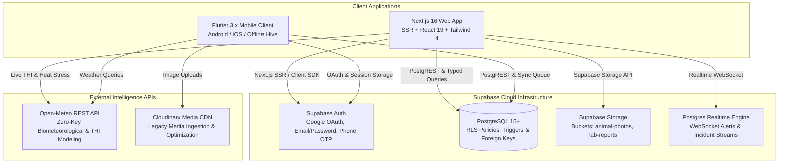

# 🛡️ FarmShield (फार्मशील्ड)
### *National Digital Livestock Surveillance, Health Intelligence & MRL Compliance Decision Support Platform*

[](https://nextjs.org)
[](https://react.dev)
[](https://typescriptlang.org)
[](https://tailwindcss.com)
[](https://flutter.dev)
[](https://supabase.com)
[](https://opensource.org/licenses/MIT)

> **Smart India Hackathon (SIH) Grand Finalist Solution**  
> An enterprise-grade, multi-stakeholder livestock health intelligence, epidemiological disease surveillance, and Maximum Residue Limit (MRL) food safety governance system. Built for Livestock Owners, Field Veterinarians, Para-Veterinary Cadres, and State Animal Husbandry Departments.

---

## 📌 Executive Overview

**FarmShield** bridges grassroots livestock care and national regulatory bodies through two complementary platforms sharing a unified Supabase cloud backbone:
1. **Next.js 16 Web Application (`/frontend`)**: Enterprise portal featuring SSR, interactive dashboards, geospatial epidemic heatmaps, batch QR passport generation, AMU governance, biometeorological THI modeling, offline sync queue, and responsive interfaces optimized from 320px to 4K displays.
2. **Flutter Mobile Application (`/farmshield`)**: Offline-first (Hive) Android/iOS client with optical QR scanning, on-field clinical symptom triage, camera image acquisition, and live sync.

---

## 🏗️ System Architecture



---

## 🌟 Next.js 16 Web Platform Features

| Module | Next.js Route | Key Capabilities |
| :--- | :--- | :--- |
| **Authentication** | `/login`, `/signup`, `/forgot-password`, `/auth/callback` | Google OAuth, Email/Password, Phone OTP, protected routes via Next.js middleware, automatic profile upsert. |
| **Command Dashboard** | `/dashboard` | Herd census KPIs, urgent containment alerts, live biometeorology (THI), AMU withdrawal status, quick-action navigation. |
| **Livestock Inventory** | `/livestock`, `/livestock/new`, `/livestock/[id]` | Full CRUD, species filtering, multi-field search, pagination, dynamic status badges, Supabase Storage photo integration. |
| **QR Animal Passports** | `/passport/[tag]`, `/qr-scanner` | Printable verified passports, live webcam/file QR scanner, batch PDF generation, direct cryptographic link validation. |
| **Clinical Triage** | `/triage`, `/triage/[id]` | 100% deterministic rule-based symptom evaluator (FMD, LSD, HS, Anthrax, Mastitis, Babesiosis), urgency matrix. |
| **Geospatial Surveillance** | `/map` | Interactive Leaflet risk map, severity heatmaps, radius risk assessment, real-time outbreak filtering. |
| **AMU & MRL Compliance** | `/amu`, `/calendar` | Antimicrobial treatment logging, withdrawal countdown clocks (meat & milk), critical drug category tagging. |
| **Lab Diagnostics** | `/lab-results`, `/lab-results/upload` | Diagnostic reports, pathogen PCR/ELISA tracking, PDF/image upload to secured Supabase `lab-reports` bucket. |
| **Offline Sync Engine** | `/offline-sync` | IndexedDB persistent queue, online/offline detection, background mutex replay, conflict resolution. |
| **Regulatory Reports** | `/reports` | Exportable health compliance summaries, MRL compliance certificates, printable veterinary documentation. |
| **Emergency Alerts** | `/alerts` | High-priority biosecurity feeds, quarantine warnings, Supabase Realtime live subscriptions. |
| **Veterinary Teleconsult**| `/teleconsult` | Tele-veterinary consultation requests, clinical notes attachment, case escalation. |
| **Farmer Community** | `/community` | Advisory forum, farmer discussions, verified veterinarian badge responses. |
| **Language & Theming** | Persistent in Navbar/Settings | English & Hindi (हिन्दी) bilingual toggle, responsive viewport optimization (320px to 1920px+). |

---

## 📁 Repository Structure

```text
FarmShield-for-SIH-app/
├── frontend/                        # Next.js 16 Web Application
│   ├── src/
│   │   ├── app/                     # 26 App Router routes (SSR + Client)
│   │   ├── components/              # 35+ Reusable UI components & dialogs
│   │   ├── contexts/                # Auth & Language contexts
│   │   ├── hooks/                   # Custom hooks (useAuth, useOfflineSync, useDebounce)
│   │   ├── lib/
│   │   │   ├── supabase/            # Browser client, Server client, Middleware client
│   │   │   ├── offline/             # IndexedDB sync queue & offline storage
│   │   │   └── utils.ts             # Tailwind class merging & formatters
│   │   ├── services/                # Supabase Data Access, Triage Engine, Weather
│   │   └── types/                   # Complete TypeScript database & model definitions
│   ├── package.json
│   └── tailwind.config.ts
├── farmshield/                      # Main Flutter Mobile Application
│   ├── lib/                         # Mobile App Router, GetX Controllers, Hive offline DB
│   └── test/                        # 35 Unit & Integration Tests (100% Passing)
├── docs/                            # Comprehensive Architecture & Setup Guides
│   ├── final-feature-audit.md       # Complete 28-feature Flutter vs Next.js audit
│   ├── SUPABASE_SETUP.md            # Supabase manual guide (SQL schema, RLS, Storage)
│   ├── MANUAL_SETUP_CHECKLIST.md    # Step-by-step Automated vs Manual deployment checklist
│   ├── flutter-analysis.md          # Deep analysis of the Flutter application
│   └── migration-map.md             # Component-by-component architectural mapping
├── backend/                         # Express / Node.js helper services
├── ml_service/                      # Python ML predictive services
└── outputs/                         # UI screenshots and application assets
```

---

## 🚀 Quick Start: Next.js 16 Web Application

### Prerequisites
- **Node.js**: `v20.x` or higher (LTS recommended)
- **npm**: `v10.x` or higher
- **Supabase Project**: (See [`docs/SUPABASE_SETUP.md`](docs/SUPABASE_SETUP.md))

### 1. Environment Setup
Navigate to the `frontend/` directory and configure `.env.local`:
```bash
cd frontend
cp .env.example .env.local
```

Populate the required environment variables:
```env
NEXT_PUBLIC_SUPABASE_URL=https://your-project-id.supabase.co
NEXT_PUBLIC_SUPABASE_ANON_KEY=eyJhbGciOiJIUzI1NiIsInR5cCI6IkpXVCJ9...
NEXT_PUBLIC_APP_URL=http://localhost:3000

# Server-only (DO NOT expose to client)
# SUPABASE_SERVICE_ROLE_KEY=your-service-role-key
```

### 2. Install Dependencies & Run Development Server
```bash
npm install
npm run dev
```
Open [http://localhost:3000](http://localhost:3000) in your browser.

### 3. Production Build & Linting Verification
```bash
# Type check and build (Turbopack)
npm run build

# Code linting check
npm run lint
```
*Verification status: 26/26 routes compile statically and dynamically with 0 errors.*

---

## 📱 Quick Start: Flutter Mobile Client

### Prerequisites
- **Flutter SDK**: `^3.10.4` or higher
- **Android SDK**: `API Level 26+`

### Installation & Launch
```bash
cd farmshield
flutter pub get
flutter test        # Runs 35 unit/integration tests
flutter run         # Launches on connected device or emulator
```

---

## 🔐 Security & Production Hardening

- **Zero Client-Side Secret Leakage**: The `SUPABASE_SERVICE_ROLE_KEY` is strictly confined to server-side environments and is never exposed to client bundles.
- **Row Level Security (RLS)**: Enforced across all PostgreSQL tables (`animals`, `treatments`, `profiles`, `alerts`, `triage_records`). Users can only modify authorized records.
- **Storage Isolation**:
  - `animal-photos`: Public read access, authenticated insert/update/delete.
  - `lab-reports`: Private bucket; signed URLs generated server-side for authorized veterinary personnel.
- **CSRF & Route Protection**: Built-in Next.js SSR middleware (`src/middleware.ts`) verifies session tokens on all `/dashboard`, `/livestock`, `/amu`, `/triage`, and `/settings` routes, redirecting unauthenticated traffic to `/login`.

---

## 📖 Key Documentation Reference

- **[Final Feature Audit](docs/final-feature-audit.md)**: 28-row matrix verifying 100% feature migration from Flutter to Next.js.
- **[Supabase Setup Guide](docs/SUPABASE_SETUP.md)**: Copy-paste SQL schema, RLS policies, trigger functions, and storage bucket configuration.
- **[Manual Setup Checklist](docs/MANUAL_SETUP_CHECKLIST.md)**: Clear separation of automated vs manual developer setup tasks.

---

## 👥 License & Acknowledgements

Developed with ❤️ for **Smart India Hackathon (SIH)**.  
Licensed under the [MIT License](LICENSE).
