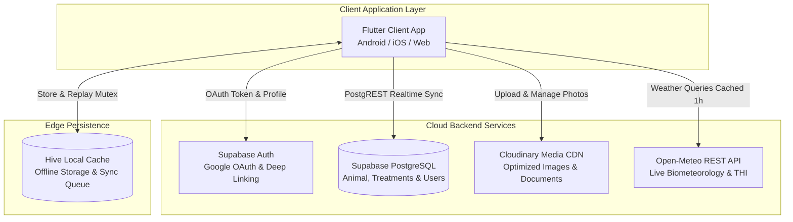

<div align="center">

# 🛡️ FarmShield (फार्मशील्ड)
### *National Digital Livestock Surveillance, Health Intelligence & MRL Compliance Decision Support Platform*

[](https://flutter.dev)
[](https://dart.dev)
[](https://supabase.com)
[](https://cloudinary.com)
[](https://open-meteo.com)
[](https://opensource.org/licenses/MIT)

<p align="center">
  <b>Smart India Hackathon (SIH) Grand Finalist Solution</b><br>
  Built for Livestock Owners, Farmers, Field Veterinarians, Para-Veterinary Cadres, and State Animal Husbandry Departments.
</p>

---

</div>

## 📌 Executive Summary

**FarmShield** is an end-to-end, multi-stakeholder animal health intelligence, disease surveillance, and food safety governance system. Its mission is the **early detection, prevention, epidemiological tracking, and coordinated veterinary response** to livestock diseases and Antimicrobial Resistance (AMR).

By combining **offline-first field capability (Hive)**, **instant QR animal identification**, **rule-based transparent clinical triage**, **geospatial epidemic risk mapping**, and **biometeorological hazard modeling (THI & vector surges)**, FarmShield bridges the critical gap between grassroots livestock care and national regulatory bodies.

---

## 📸 Application Interface

<div align="center"> 
   
   
   
   
</div>

<br>

<div align="center">
   
   
   
   
</div>

<br>

<div align="center">
   
   
   
   
</div>

<br>

<div align="center">
   
   
   
   
</div>

---

## 🌟 Core Feature Modules

### 1. 🔐 Google Authentication & Persistent Sessions (Supabase Auth)
- **Zero-Friction Single Sign-On (SSO)**: Seamless Google OAuth integrated directly with Supabase Authentication.
- **Deep Linking Protocol**: Custom URI callback `io.supabase.farmshield://login-callback` for immediate app resumption on Android/iOS/Web without webview traps.
- **Persistent State Gate**: Re-opening the app securely checks existing cached sessions, booting authenticated users directly to the command dashboard with zero login-screen flicker.
- **Automatic Profile Upsert**: Onboards Google user metadata (full name, email, avatar) into the PostgreSQL `public.users` table while retaining existing roles and data integrity.

### 2. 🔍 Dynamic QR Animal Passport & Cloudinary Media Pipeline
- **Instant Optical Identification**: High-performance camera scanner with fallback manual tag input. Resolves URLs (`https://farmshield.in/qr/COW-101`), raw tokens, and UUIDs.
- **Optimized Image Ingestion**: Multi-part image picking (Camera / Gallery) with automatic size capping (10MB), extension validation, and upload to Cloudinary.
- **Clean Media Lifecycle**: Deletes orphaned previous cloud images upon update to conserve storage quotas and persists direct HTTPS URLs to Supabase.
- **Digital Passport**: Generates verifiable QR digital passports and exportable, tamper-proof veterinary medical health certificates in PDF format.

### 3. 🧠 Clinical Decision Support & Explainable Triage
- **Rule-Based Triage Engine**: Transparent clinical logic (100% deterministic, zero opaque AI hallucination) evaluating multi-system syndromic signs:
  - **FMD (Foot-and-Mouth Disease)**: Oral vesicles, drooling, coronary lesions &rarr; Urgent Biosecurity Alert.
  - **LSD (Lumpy Skin Disease)**: Cutaneous nodular eruptive lesions, limb edema &rarr; High Priority Vector Containment.
  - **HS (Hemorrhagic Septicemia)**: Submandibular throat edema, acute respiratory distress &rarr; Critical Emergency.
  - **Anthrax**: Sudden death, orifice non-clotting hemorrhage &rarr; Immediate Carcass Handling Precaution (**DO NOT OPEN CARCASS**).
  - **Clinical Mastitis**: Hard swollen quarters, clot/flake milk &rarr; Strict milk withholding protocol.
  - **Bovine Babesiosis (Tick Fever)**: Red urine (hemoglobinuria), high fever &rarr; Tick acaricide protocol.
- **Interactive Triage Sheet**: Live symptom chips, rectal temperature slider, reactive urgency badges, and step-by-step containment checklists.

### 4. 📊 Herd Health Intelligence & Surveillance
- **Herd Analytics Dashboard**: Aggregated herd metrics tracking total head count, proportion distributions across health states (`Healthy`, `Under Observation`, `Affected`, `Critical`, `Recovered`, `Deceased`).
- **Vaccination Compliance Index**: Tracks mandatory booster schedules, overdue immunizations, and herd-wide coverage percentages.
- **Explainable Herd Risk Score (0-100)**: Multi-factor algorithm weighing disease severity, recent clinical velocity (72-hour clusters), and vaccination vulnerabilities.

### 5. ⛅ Meteorological Hazard & THI Heat Stress Modeling
- **Zero-Key Weather Ingestion**: Integrated with the Open-Meteo REST API (zero cost, zero API keys exposed) with 1-hour local coordinate caching.
- **Temperature-Humidity Index (THI)**:
  $$\text{THI} = (1.8 \times T + 32) - (0.55 - 0.0055 \times RH) \times (1.8 \times T - 26)$$
- **Heat Stress Classification**: Normal (&lt; 72), Alert (72-78), Danger (79-88), Emergency (&ge; 89).
- **Vector-Borne Proliferation Multiplier**: Real-time surge warning for *Culicoides* midges, *Stomoxys* biting flies, and ticks linked directly to LSD and Babesiosis outbreaks.

### 6. 🗺️ Geospatial Risk Map & Epidemic Heatmaps
- **Interactive Google Maps Engine**: Smooth pan, zoom, cluster, and camera bounding controls.
- **Multi-Layer Visualization**:
  - **Hybrid**: Risk heat halos alongside animal and incident markers.
  - **Heatmap**: Weighted semi-transparent gradient circles indicating disease severity.
  - **Markers**: Color-coded pins with interactive bottom sheets detailing clinical findings.
- **Epidemiological Filtering**: Real-time filtering by pathogen (`All`, `FMD`, `LSD`, `HS`, `Mastitis`, `Anthrax`) and live meteorological risk overlay.

### 7. 💊 Maximum Residue Limit (MRL) & AMU Governance
- **AMU Tracker**: Logs antimicrobial usage by active ingredient and class (Highest Priority Critically Important Antimicrobials).
- **Withdrawal Countdown**: Dynamic real-time countdown timer showing remaining milk and meat withholding days to prevent contaminated food products from entering the human supply chain.
- **Standardized Drug Catalog**: Preloaded with regulatory guidelines, dosage norms, and withdrawal days.

---

## 🏗️ System Architecture



---

## 📁 Repository Structure

```text
FarmShield-for-SIH/
├── farmshield/                      # Main Flutter Application
│   ├── android/                     # Android Native Config & Deep Link Intents
│   │   └── app/src/main/AndroidManifest.xml
│   ├── lib/
│   │   ├── main.dart                # App Entrypoint & Session Startup Gate
│   │   ├── app/
│   │   │   ├── core/
│   │   │   │   ├── services/        # Triage Engine, Weather, Cloudinary, Hive
│   │   │   │   ├── theme/           # Design System, Colors, Typography, Spacing
│   │   │   │   └── widgets/         # AppButton, AppCard, AppTextField, NavBars
│   │   │   ├── data/
│   │   │   │   ├── models/          # Animal, Health, Risk, Geo, KPI Models
│   │   │   │   └── repositories/    # FarmRepository (Supabase & Offline Sync)
│   │   │   ├── modules/
│   │   │   │   ├── auth/            # Google OAuth, Email, OTP Login & Register
│   │   │   │   ├── dashboard/       # KPI, AMU, Countdown, Weather & Trend Cards
│   │   │   │   ├── animal_detail/   # Profile, QR Card, Timeline, Triage Modal
│   │   │   │   ├── animal_passport/ # QR Scanner, Verifiable Passports, PDF
│   │   │   │   ├── geospatial_risk/ # Interactive Google Maps Risk View
│   │   │   │   ├── livestock/       # Herd View, Health Ratios, Species Filter
│   │   │   │   ├── calendar/        # AMU Withdrawal Timelines
│   │   │   │   └── reports/         # PDF Regulatory Certificate Export
│   │   │   └── routes/              # GetX Pages & Route Names
│   │   └── firebase_options.dart
│   └── test/                        # 35 Unit & Integration Tests (100% Pass)
├── backend/                         # Node.js / Express Helper Services
├── ml_service/                      # Python ML Predictive Services
└── outputs/                         # Application UI Screenshots
```

---

## 🚀 Getting Started

### Prerequisites
- **Flutter SDK**: `^3.10.4` or higher
- **Dart SDK**: `^3.10.4`
- **Android SDK**: `API Level 26+` (Android 8.0+)
- **Supabase Account**: Project configured with Google Auth Provider

### Installation

1. **Clone the Repository**:
   ```bash
   git clone https://github.com/vikashkr96/FarmShield-for-SIH.git
   cd FarmShield-for-SIH/farmshield
   ```

2. **Install Flutter Dependencies**:
   ```bash
   flutter pub get
   ```

3. **Configure Environment Secrets**:
   Create or verify `farmshield/android/app/src/main/res/values/secrets.xml`:
   ```xml
   <?xml version="1.0" encoding="utf-8"?>
   <resources>
       <string name="google_maps_api_key">YOUR_GOOGLE_MAPS_API_KEY</string>
   </resources>
   ```

4. **Run Unit & Integration Tests**:
   ```bash
   flutter test
   ```
   *Expected result: All 35 tests pass with 0 errors.*

5. **Launch Application**:
   ```bash
   # Launch on connected Android device / emulator
   flutter run

   # Launch on Web with Chrome
   flutter run -d chrome
   ```

---

## ⚙️ Cloud & Supabase Configuration Guide

To configure Google OAuth with Supabase in your own instance:

### 1. Google Cloud Console
1. Navigate to [Google Cloud Console](https://console.cloud.google.com/).
2. Under **APIs & Services &rarr; OAuth consent screen**, set up your app name and contact email.
3. Under **Credentials &rarr; Create Credentials &rarr; OAuth client ID**:
   - Application Type: **Web application**.
   - Authorized Redirect URIs:
     ```text
     https://<YOUR-SUPABASE-PROJECT-ID>.supabase.co/auth/v1/callback
     ```
4. Copy the **Client ID** and **Client Secret**.

### 2. Supabase Dashboard
1. Go to **Authentication &rarr; Providers &rarr; Google**:
   - Turn **ON** Google provider.
   - Paste your **Client ID** and **Client Secret**.
2. Go to **Authentication &rarr; URL Configuration**:
   - Add to Redirect URLs:
     ```text
     io.supabase.farmshield://login-callback
     ```

---

## 🧪 Testing & Quality Assurance

The codebase includes an automated test suite covering all mission-critical algorithms:

| Test Suite | Focus Area | Status |
|---|---|:---:|
| `health_intelligence_test.dart` | Clinical Triage Rules, THI Equations, Herd Health Ratios | ✅ PASS |
| `geospatial_risk_test.dart` | Coordinate validation, risk weighting, cluster calculations | ✅ PASS |
| `qr_and_animal_workflow_test.dart` | QR URL parsing, Cloudinary Public ID extraction, Animal models | ✅ PASS |
| `auth_flow_test.dart` | Role normalization, deep link callback URI formatting | ✅ PASS |
| `widget_test.dart` | Design tokens, color palettes, responsive typography | ✅ PASS |

```bash
flutter test
# Result: 35/35 passed in ~2.8s
```

---

## 👥 Contributors & Acknowledgements

Developed with ❤️ for **Smart India Hackathon (SIH)**.
Special thanks to the veterinary officers and farmers whose feedback shaped FarmShield's clinical triage and MRL decision support workflows.

---

<div align="center">
  <sub>FarmShield • Protecting Livestock, Ensuring Food Safety, Empowering Farmers</sub>
</div>
